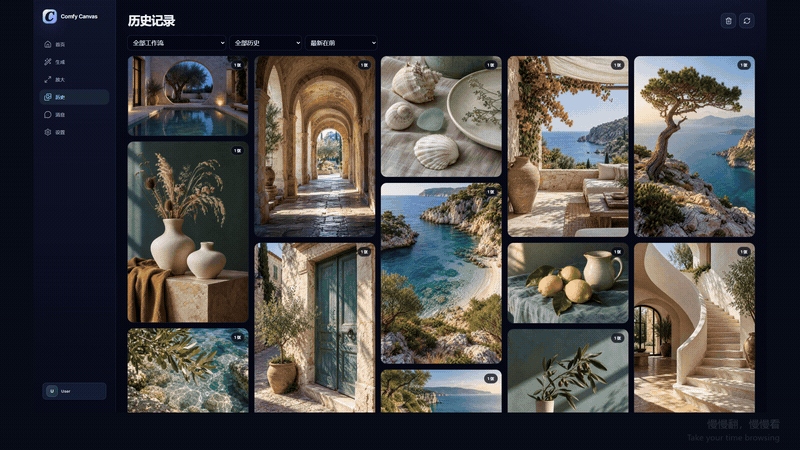
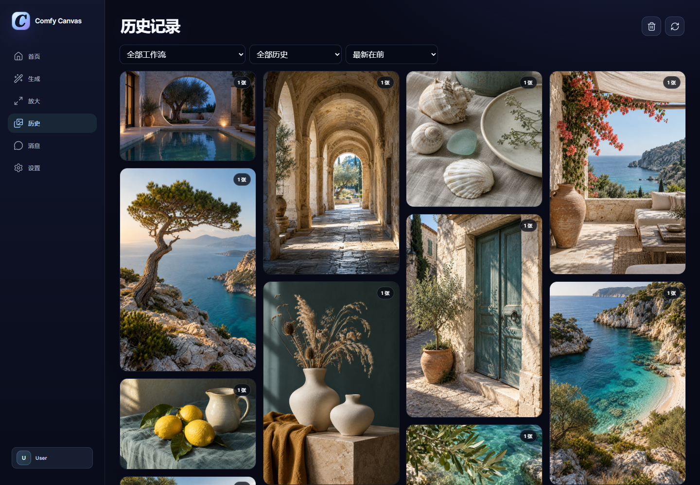

# Comfy Canvas

[English](README.en.md) · [1.0.1 版本说明](docs/releases/1.0.1.md)

在电脑和手机浏览器中生成图片、编辑图片、制作视频，再用瀑布流浏览和管理作品。Comfy Canvas 基于 ComfyUI，在 Windows 电脑上运行，既可以自己用，也可以让同一局域网里的其他人一起用。

[](docs/showcase/comfy-canvas-film-v10.mp4)

[播放完整视频 · 2:28](docs/showcase/comfy-canvas-film-v10.mp4) · [桌面端](docs/showcase/desktop/README.md) · [手机端](docs/showcase/mobile/README.md)

## 让作品成为界面的主角

深色背景、圆角卡片和大幅预览，把更多空间留给图片。横图与竖图保留各自比例，排成瀑布流；从一张作品点进去，就能查看细节、对比原图，或带着参数继续编辑。



桌面端把参考图、编辑要求和生成参数分步呈现。手机端则用全屏图片浏览、底部操作栏和悬浮导航适应小屏幕；双指收拢或张开，可以在一、二、三列瀑布流之间切换。

## 从创作到整理

- **图片生成**：使用 Krea Turbo 输入提示词直接文生图，无需参考图片；调整画幅、生成数量、Seed 和最多十个 LoRA 的权重。
- **图片编辑**：修改已有图片，上传或裁切参考图，对比生成前后的效果，再继续编辑或高清放大。
- **视频生成**：通过文字描述或首帧图片生成视频，设置时长与画幅，查看和播放结果。
- **任务进度**：查看排队与生成状态，取消任务，完成后直接查看结果。
- **继续创作**：放大、拖动、对比原图，复用参数或接着编辑。
- **作品管理**：筛选、排序、收藏和分享；误删的作品可在回收站保留期内恢复。

支持 Krea2 Turbo 文生图、Krea2 Identity Edit、Qwen Image Edit 2511 和 MiniMax H3。[查看工作流与完整功能](docs/features.md)

## 选择使用方式

### 自己使用

在自己的 Windows 电脑上运行 ComfyUI 和 Comfy Canvas，用浏览器完成创作与作品管理。

仅在这台电脑访问时，将配置中的 `server.host` 设为 `127.0.0.1`，打开 `http://127.0.0.1:8090` 即可。如果想用自己的手机操作，也可以按下面的局域网配置，登录同一个账号。

### 本机作为服务器，多人使用

由一台 Windows 电脑运行 ComfyUI、模型和 Comfy Canvas，其他人用同一局域网里的电脑或手机访问，无需在各自设备安装模型。

- 将 `server.host` 设为 `0.0.0.0`，访问启动窗口显示的局域网地址。
- 管理员在“设置 → 用户与邀请”中生成邀请码，其他人注册自己的账号。
- 各账号管理自己的作品，通过消息分享结果；生成任务共用服务器的显卡和队列。
- 管理员可以查看用户、存储和队列，并在配置中设置用户限额。

服务器电脑需要保持开机，ComfyUI 和 Comfy Canvas 都要运行。

## 安装

先准备能够运行所需工作流的 ComfyUI 环境，以及 Python 3.12 / 3.13、Git、Node.js 22 和 FFmpeg。

在项目目录运行：

```powershell
Set-ExecutionPolicy -Scope Process Bypass
.\scripts\bootstrap.ps1
```

编辑 `config.toml`，填写 ComfyUI 目录、服务地址、输出目录和模型文件名。先启动 ComfyUI，再双击 `启动ComfyCanvas.bat`；首次启动会提示创建管理员账号。

[安装与配置](docs/setup.md) · [模型清单](docs/models.md) · [节点依赖](docs/dependencies.md)

## 项目

由 Atal1a 设计与开发。后端使用 FastAPI 和 SQLite，通过 HTTP / WebSocket 连接 ComfyUI。

[开发与测试](CONTRIBUTING.md) · [第三方组件](THIRD_PARTY_NOTICES.md) · [工作流来源](docs/workflow-provenance.md) · [素材说明](docs/showcase/NOTES.md) · [安全说明](SECURITY.md)

## 许可证

Copyright © 2026 Atal1a。项目自有代码采用 [GNU GPL v3.0](LICENSE)（`GPL-3.0-only`）。第三方代码、模型和工作流遵循各自许可证，见[第三方说明](THIRD_PARTY_NOTICES.md)。
