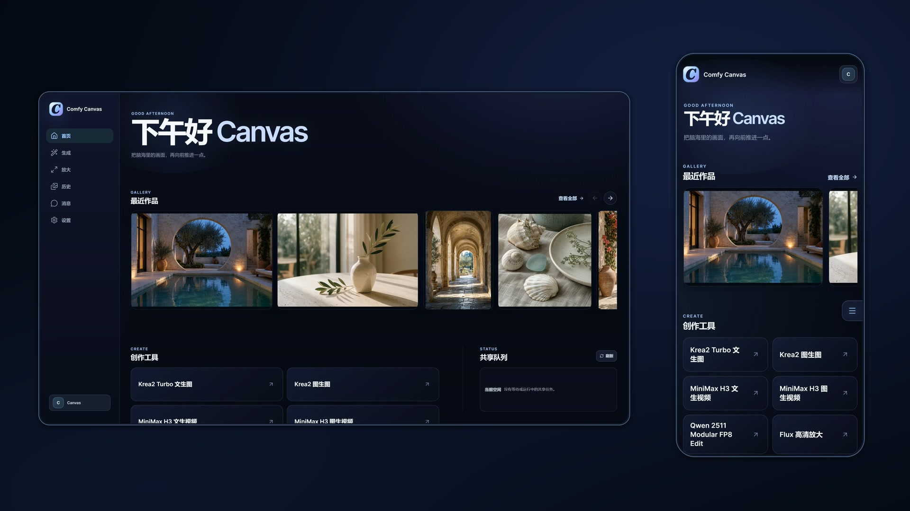
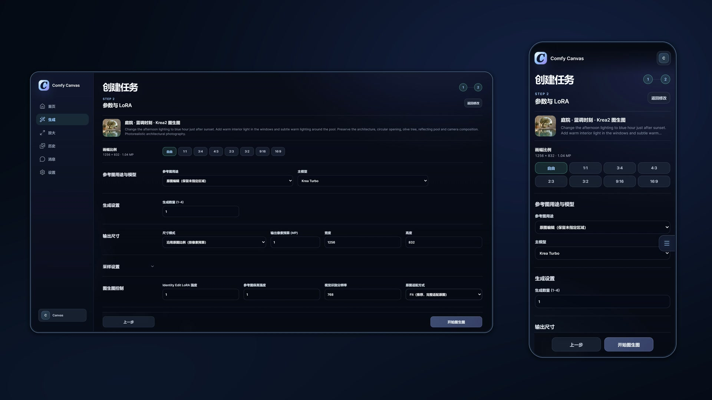
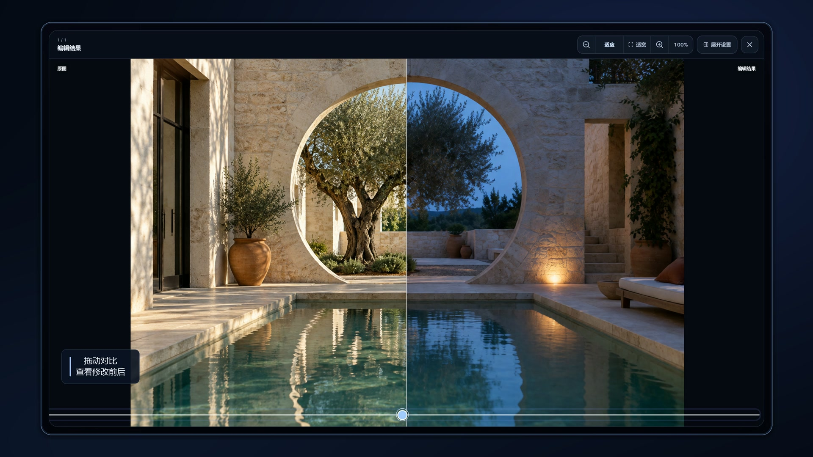
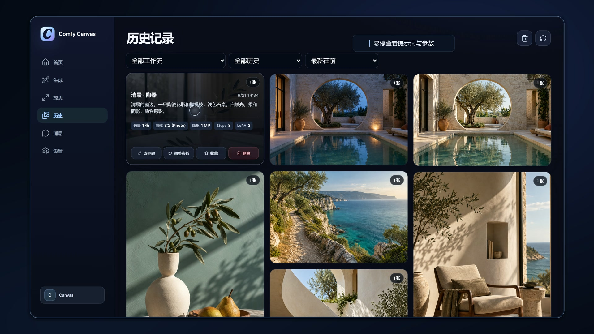
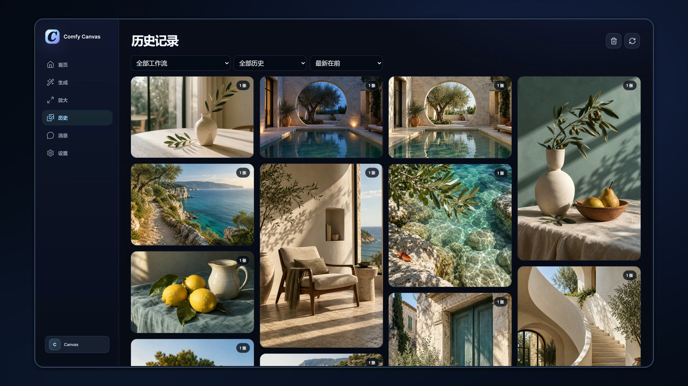

<h1 align="center">Comfy Canvas</h1>

<p align="center">
  <strong>Make ComfyUI easier to use.</strong><br>
  An open-source creative interface for desktop and mobile.
</p>

<p align="center">
  <a href="#install">Install</a> ·
  <a href="features.md">Features & workflows</a> ·
  <a href="releases/1.0.1.md">Release notes</a> ·
  <a href="../README.md">中文</a>
</p>

[](showcase/intro/comfy-canvas-intro.mp4)

<p align="center"><a href="showcase/intro/comfy-canvas-intro.mp4">Watch the demo · 55 seconds</a></p>

Comfy Canvas brings parameter forms, a task queue, result previews and a gallery to ComfyUI. Upload a reference, write a prompt, adjust settings, then inspect the result, compare it with the original or reuse its settings for another edit.

Run it on your own Windows PC and access it through a desktop or phone browser. You can also share access with other people on the same LAN.

## Create and keep editing

- **Generate and edit images**: start with a text prompt or upload a reference and describe your changes. Set dimensions, seeds and LoRAs.
- **Generate videos**: start with text or a first-frame image, set duration and aspect ratio, then play the result.
- **Continue editing**: reuse the original image, prompt and settings for another generation, or upscale a result.



Comfy Canvas provides a dedicated creative interface for workflows built by the project's author. The current version supports only the workflows listed below and their corresponding models.

Krea2 Turbo, Krea2 Identity Edit, Qwen Image Edit 2511, MiniMax H3, and Flux upscaling. [Full feature and workflow list](features.md)

## Inspect results and generation settings

| Drag to compare the original and result | Hover on desktop to see prompts and settings |
| :---: | :---: |
|  |  |

Open a work to zoom in and pan across details. On a phone, pinch to zoom into an image or change the number of gallery columns.

## Browse and organize your work

Portrait and landscape images keep their proportions in a masonry gallery. Filter, sort and collect works, follow generation progress, or share results with another account. Deleted works can be restored during the recycle-bin retention period.



[More desktop controls](showcase/desktop/README.md) · [More mobile controls](showcase/mobile/README.md)

## Choose how to use it

**Personal use**: run ComfyUI and Comfy Canvas on your Windows PC, then create and organize work from a desktop or phone browser.

**Shared LAN access**: one Windows PC runs the models while other people connect through their browsers. Each account manages its own works; generation uses the server GPU and shared queue.

<details>
<summary>Local and LAN configuration</summary>

For access from the server PC only, set `server.host` to `127.0.0.1` in `config.toml`, then open `http://127.0.0.1:8090`.

For a phone or another device on the same LAN, set `server.host` to `0.0.0.0` and use the LAN address shown in the launch window. You can sign in with the same account on your own devices.

Administrators can create invitation codes in the user settings so others can register their own accounts. They can also manage users, storage and the queue, with user limits in the configuration.

Keep the server PC, ComfyUI and Comfy Canvas running. See the [setup guide](setup.md) for details.

</details>

## Install

Prepare a ComfyUI environment that can run your chosen workflows, plus Python 3.12 / 3.13, Git, Node.js 22 and FFmpeg.

Run in the project directory:

```powershell
Set-ExecutionPolicy -Scope Process Bypass
.\scripts\bootstrap.ps1
```

Set the ComfyUI directory, service URL, output directory and model filenames in `config.toml`. Start ComfyUI, then run `启动ComfyCanvas.bat`. The first launch prompts you to create an administrator account.

[Setup guide (Chinese)](setup.md) · [Models](models.md) · [Custom nodes](dependencies.md)

## Project

Designed and developed by Atal1a. Built with FastAPI and SQLite, communicating with ComfyUI through HTTP / WebSocket.

[Contributing](../.github/CONTRIBUTING.md) · [Third-party components](THIRD_PARTY_NOTICES.md) · [Workflow sources](workflow-provenance.md) · [Demo assets](showcase/NOTES.md) · [Security](../.github/SECURITY.md)

## License

Copyright © 2026 Atal1a. Project-authored code is licensed under [GNU GPL v3.0](../LICENSE) (`GPL-3.0-only`). Third-party code, models and workflows retain their own licenses; see [third-party notices](THIRD_PARTY_NOTICES.md).
