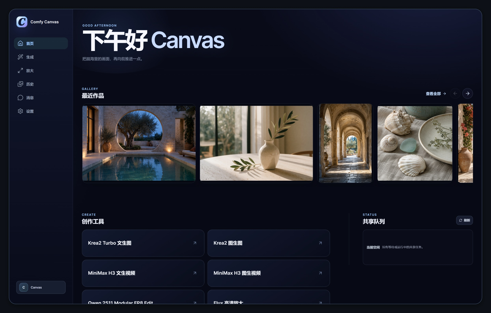
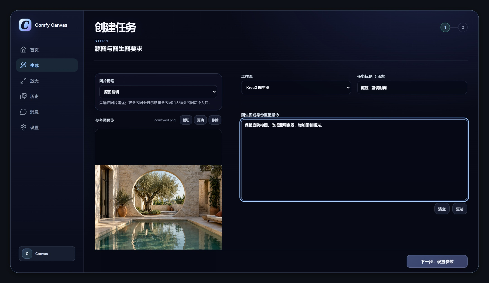
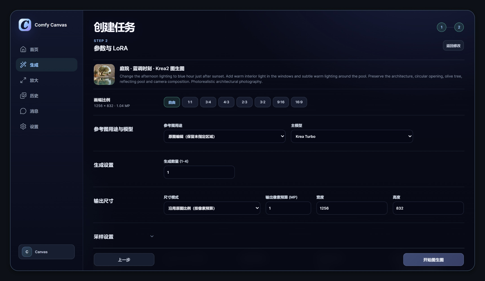
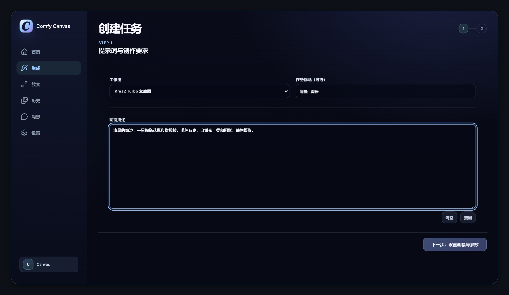
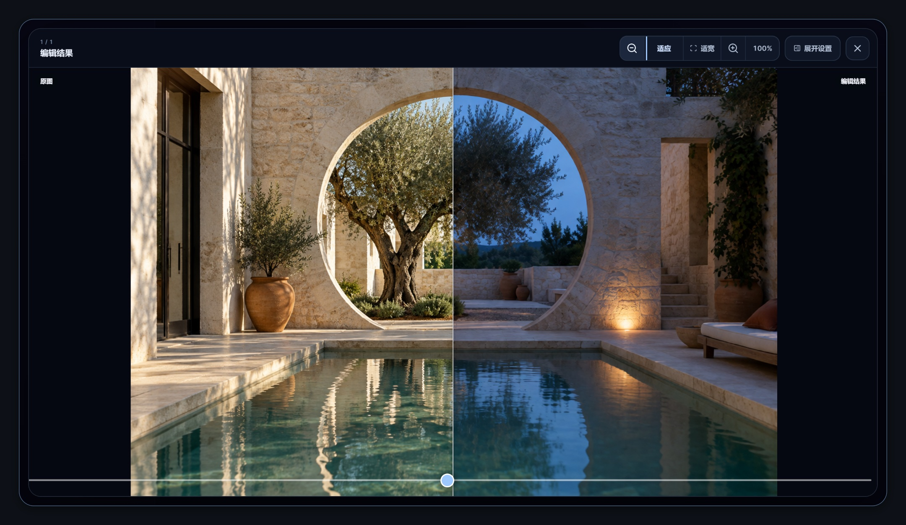
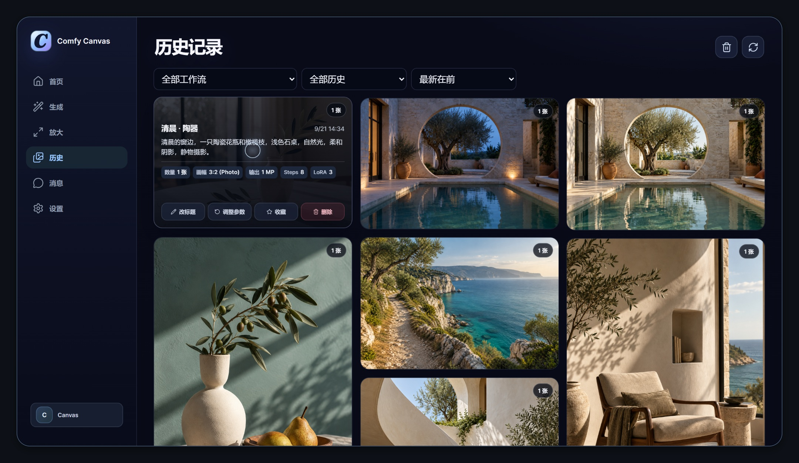
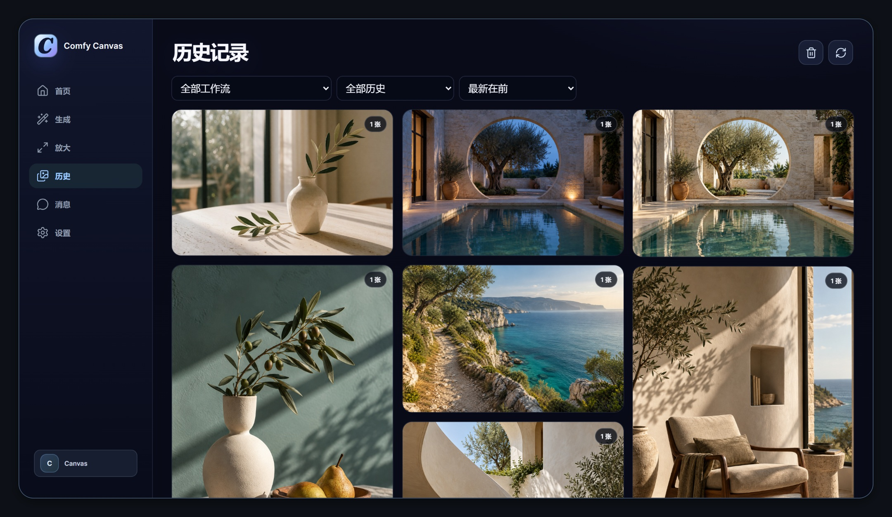
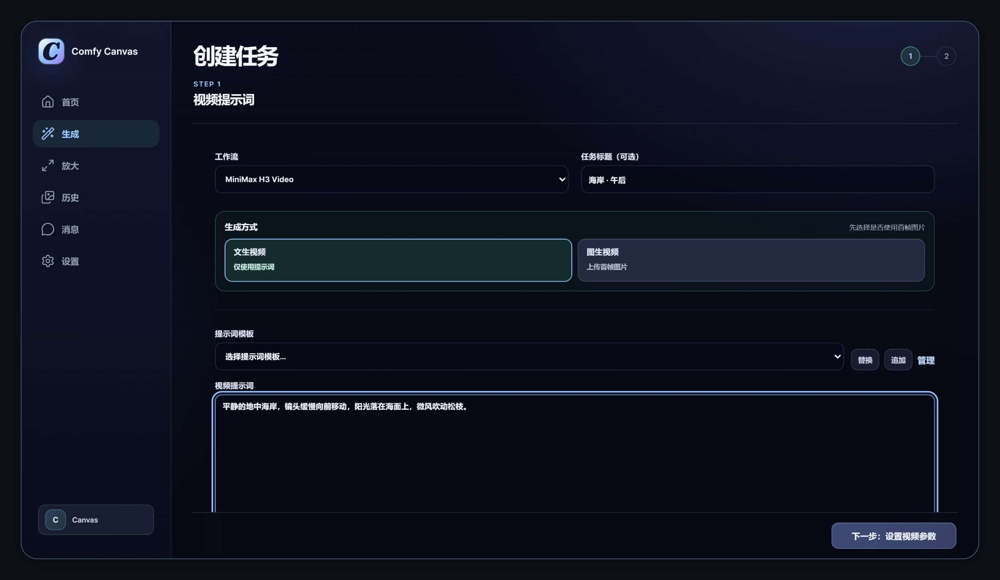

<h1 align="center">桌面端</h1>

在一个窗口里完成创作、查看与整理。

  <a href="../../../README.md">项目首页</a> ·
  <a href="../mobile/README.md">手机展示</a> ·
  <a href="../../features.md">功能与工作流</a> ·
  <a href="../intro/comfy-canvas-intro.mp4">观看介绍视频</a>

从最近作品继续编辑，或选择工具开始新的任务。首页同时显示共享队列，便于查看当前的生成状态。

## 分步创建任务

先选择工作流、上传参考图并填写修改要求，再设置画幅、生成数量、Seed 和 LoRA。文生图可以直接从提示词开始。

查看画幅、模型与生成参数

从文字开始生成图片

Krea2 Turbo 的文生图页面无需上传参考图。填写画面描述后，进入下一步设置画幅与参数。

## 对比结果，接着修改

拖动分隔线查看原图与结果的差别，也可以放大、拖动检查局部。复用参数时，原图、提示词和生成设置会带回创作页面。

[观看拖动对比 · 60 帧](current/compare.mp4)

## 悬停查看提示词与参数

鼠标移到作品卡片上，即可查看提示词和主要参数。卡片上还可以收藏作品、调整参数或打开原图。

[观看悬停操作 · 60 帧](current/hover.mp4)

## 浏览与整理作品

横图与竖图保留各自比例，排列成瀑布流。按工作流、收藏夹和时间筛选作品；用独立账号保存内容，也可以通过消息分享结果。

查看作品瀑布流

删除的作品进入回收站，15 分钟内可以恢复，逾期自动永久清理。

## 视频与任务

MiniMax H3 支持从文字或首帧图片生成视频。填写内容后设置时长、画幅等参数，完成后在结果页播放。运行中的任务可以查看进度或取消。

查看视频创作页面

管理员还可以管理用户、邀请码、存储与共享队列，查看运行诊断。

[安装与配置](../../setup.md) · [手机展示](../mobile/README.md) · [展示素材说明](../NOTES.md)
