# 手机端

[返回展示首页](../../../README.md) · [查看桌面端](../desktop/README.md)

部分图片用于界面演示；陶器文生图、庭院日夜对比与海岸视频为实际工作流结果。

## 文生图

输入提示词、选择画幅和 LoRA，不需要参考图片。

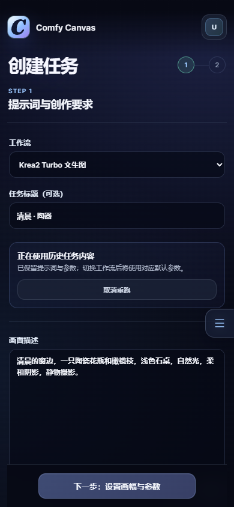

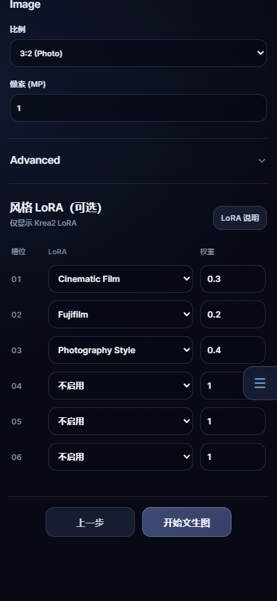

查看实际生成结果，再打开媒体信息或复用参数。

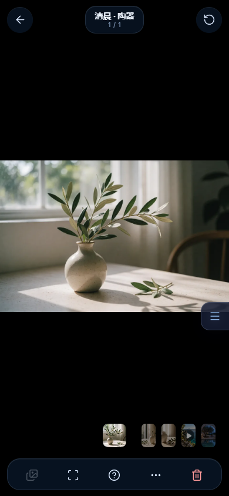

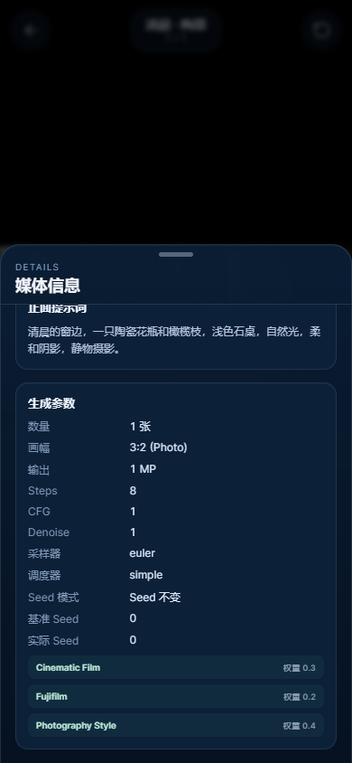

## 单张图片缩放

这与瀑布流列数缩放是两个操作：打开原图后，双指放大，再拖动查看局部。

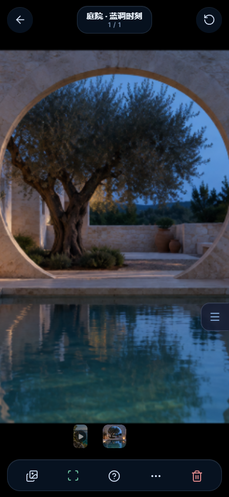

[原图缩放与拖动](photo-zoom-pan.mp4) · [拖动比较原图与编辑结果](photo-compare-drag.mp4)

## 视频与分享

直接在媒体浏览页播放实际生成的视频。

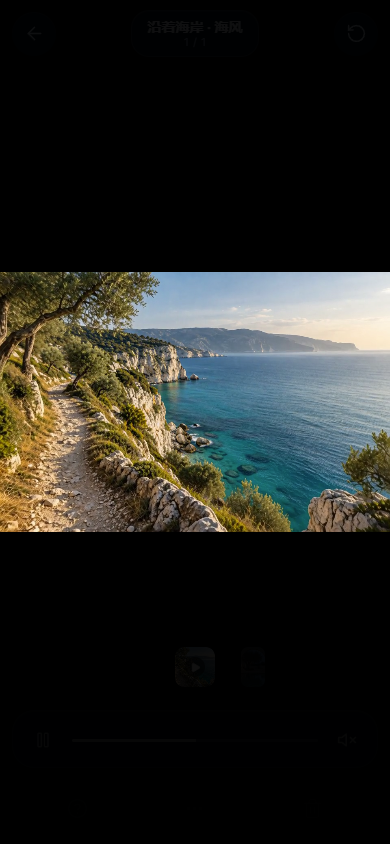

另一个演示账号接收分享后，可以打开作品查看输入图与参数。

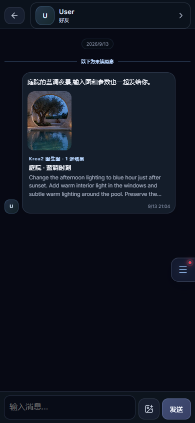

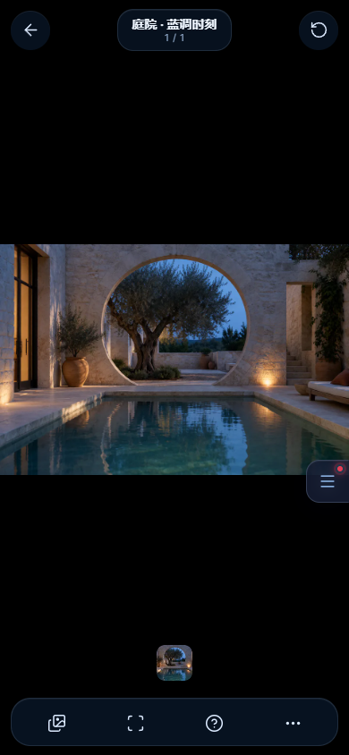

悬浮导航可在浏览图片时展开。

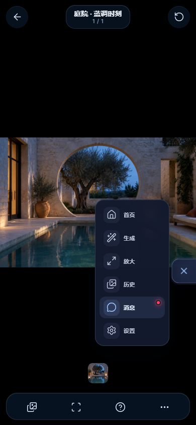

## 回收站

删除后可以在 15 分钟内恢复，也可以直接打开或刷新回收站页面。

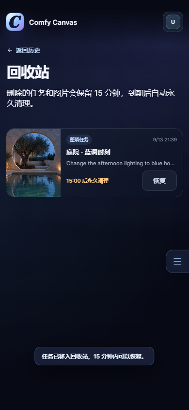

[手机删除与恢复操作](recycle-restore.mp4)

## 首页

查看最近作品，选择接下来要用的创作工具。

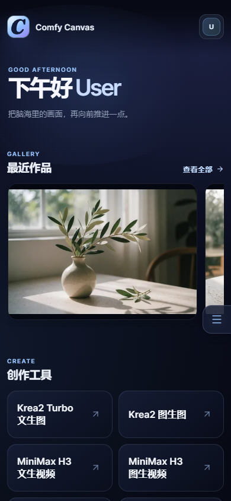

## 创作

先上传参考图。

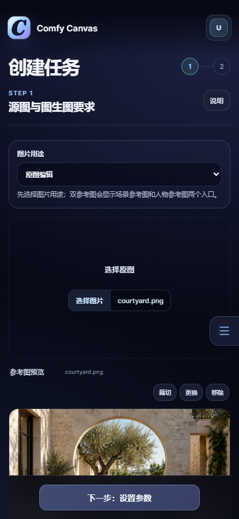

向下滚动，填写编辑要求。

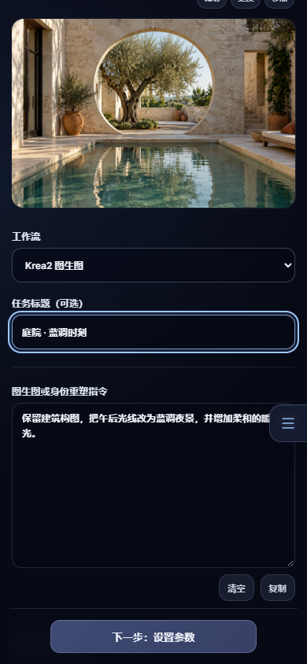

下一步设置画幅和参数。

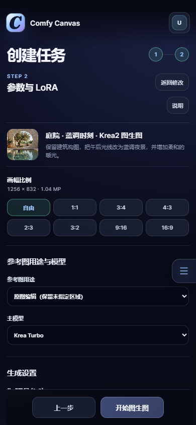

## 浏览作品

### 瀑布流列数缩放

双指收拢可以从大图切换到多列浏览，张开则回到大图；下面是同一组作品、同一视口的三种布局。

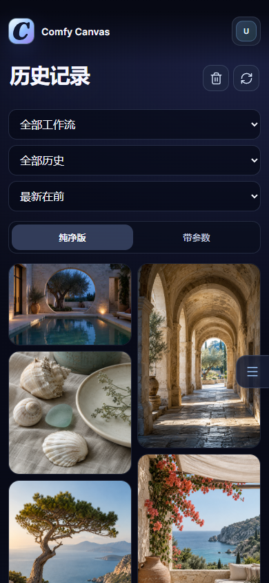

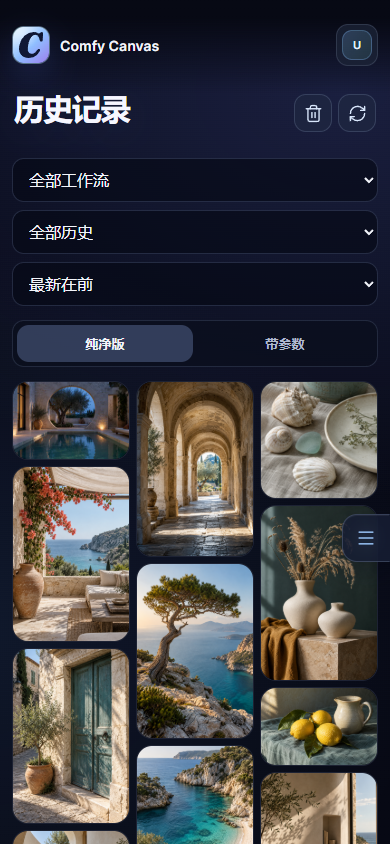

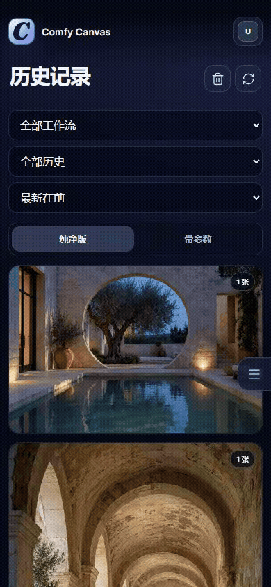

[双指缩放清晰视频](gallery-density-pinch.mp4)

三种密度分别向下浏览：[一列](gallery-scroll-1-column.mp4) · [两列](gallery-scroll-2-column.mp4) · [三列](gallery-scroll-3-column.mp4)。

[打开图片、切换作品再返回](gallery-open-return.mp4)。刷新后保留所选列数。切换作品后返回列表，浏览位置可能改变；列数缩放会围绕手势位置重新排列。

### 滚动与收藏

向下滚动浏览历史作品，也可以切换为只看收藏。

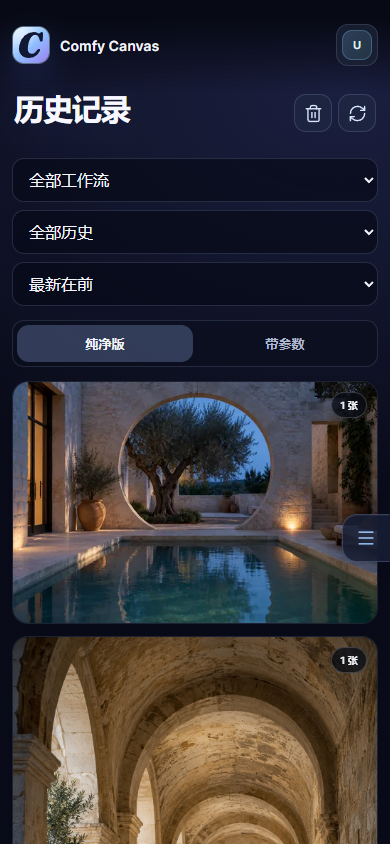

[观看清晰版视频](gallery-scroll.mp4)

收藏筛选

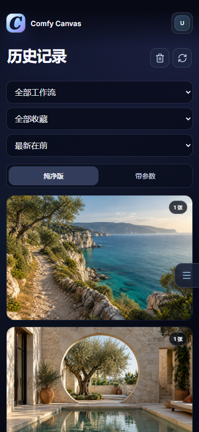

## 查看结果

图片单独打开，底部可以切换作品或打开更多操作。

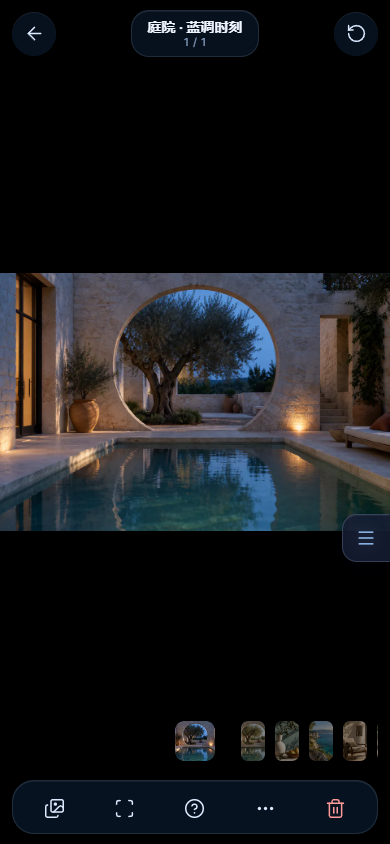

打开原图对比。

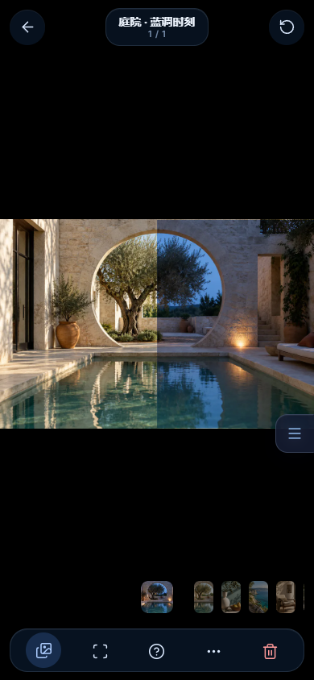

媒体信息面板中保留提示词和生成参数。

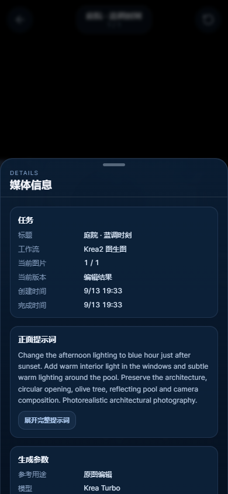

## 向下浏览

首页往下可看创作入口和队列；媒体信息面板内可以继续查看生成参数。

Scroll through the home page and the image settings panel.

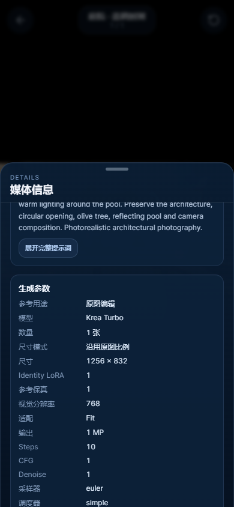
