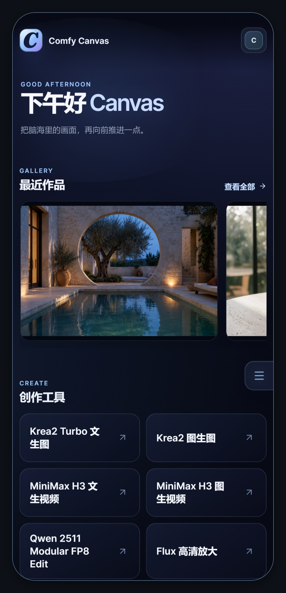
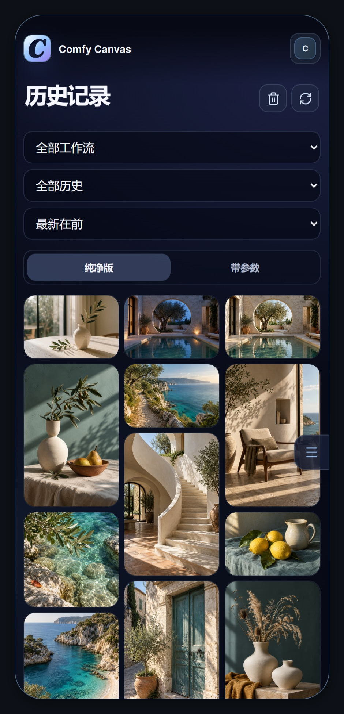
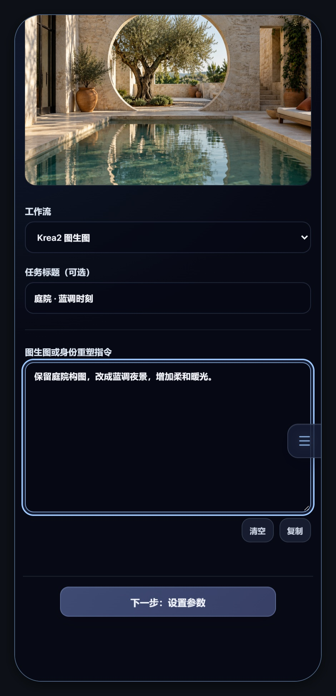
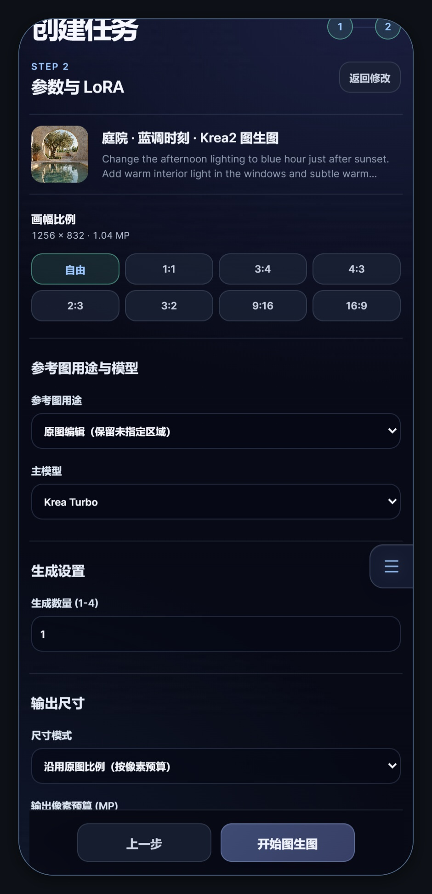
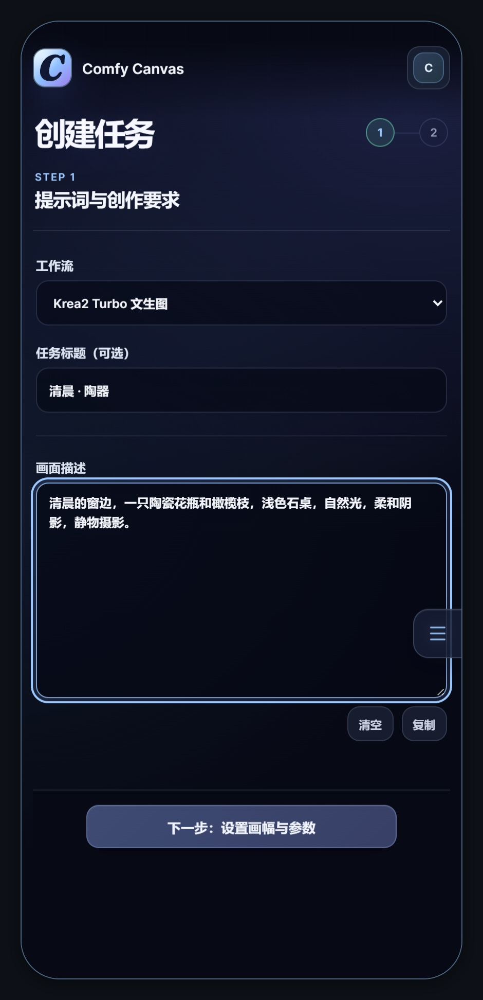
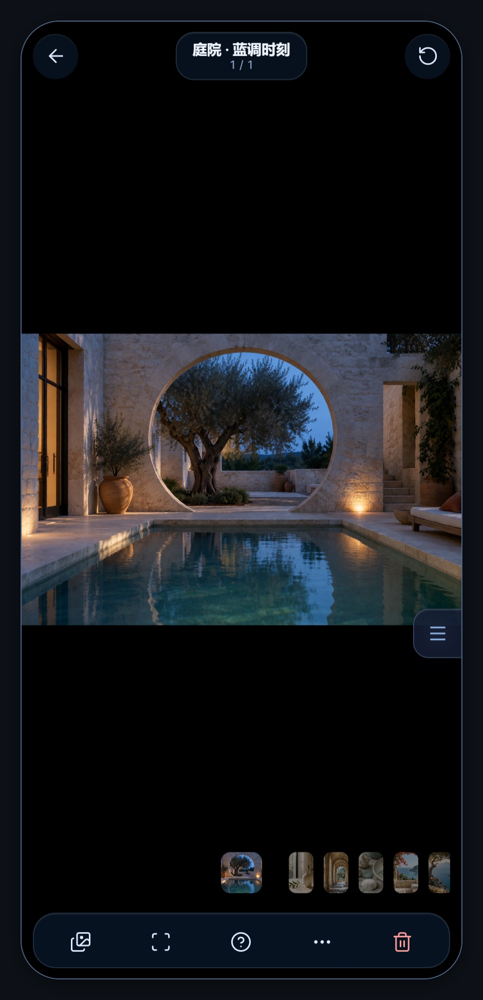
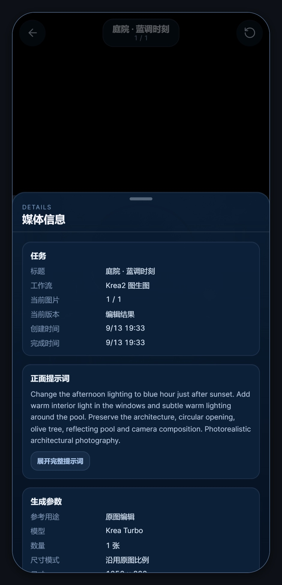
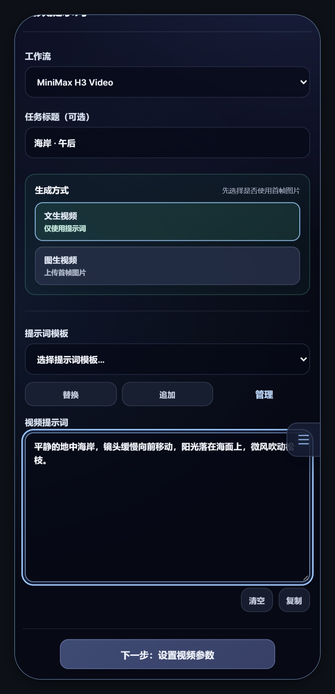

<h1 align="center">手机端</h1>

在手机浏览器里创作、查看与继续修改。

  <a href="../../../README.md">项目首页</a> ·
  <a href="../desktop/README.md">桌面展示</a> ·
  <a href="../../features.md">功能与工作流</a> ·
  <a href="../intro/comfy-canvas-intro.mp4">观看介绍视频</a>

  
  

连接同一局域网后，手机通过浏览器访问电脑上的 Comfy Canvas。登录同一个账号，即可查看作品、创建任务和继续修改。

## 填写内容，调整参数

上传图片并描述修改要求，再进入参数页设置画幅、模型和生成数量。底部保留当前步骤的操作按钮。

  
  

从文字开始生成图片

选择 Krea2 Turbo，直接填写画面描述，无需参考图片。

## 用手势浏览作品

在瀑布流中双指收拢或张开，可以切换一、二、三列布局。打开单张图片后，双指缩放、拖动查看细节；底部缩略图用于切换作品。

  

[观看瀑布流列数切换 · 60 帧](current/gallery-gesture.mp4) · [观看图片缩放 · 60 帧](current/image-zoom.mp4)

## 带着参数继续修改

在媒体信息中查看提示词和生成参数。选择调整参数后重跑，会回到创作页面，保留原有内容供继续修改。

[观看返回参数页并继续调整 · 60 帧](current/continue-editing.mp4)

查看媒体信息面板

## 视频与作品管理

视频创作同样支持文字和首帧图片输入，完成后可在手机上播放。通过筛选和收藏整理作品，也可以向其他账号分享结果。

查看视频创作页面

删除的作品进入回收站，15 分钟内可以恢复，逾期自动永久清理。

[局域网访问设置](../../setup.md#局域网访问与多人使用) · [桌面展示](../desktop/README.md) · [展示素材说明](../NOTES.md)
